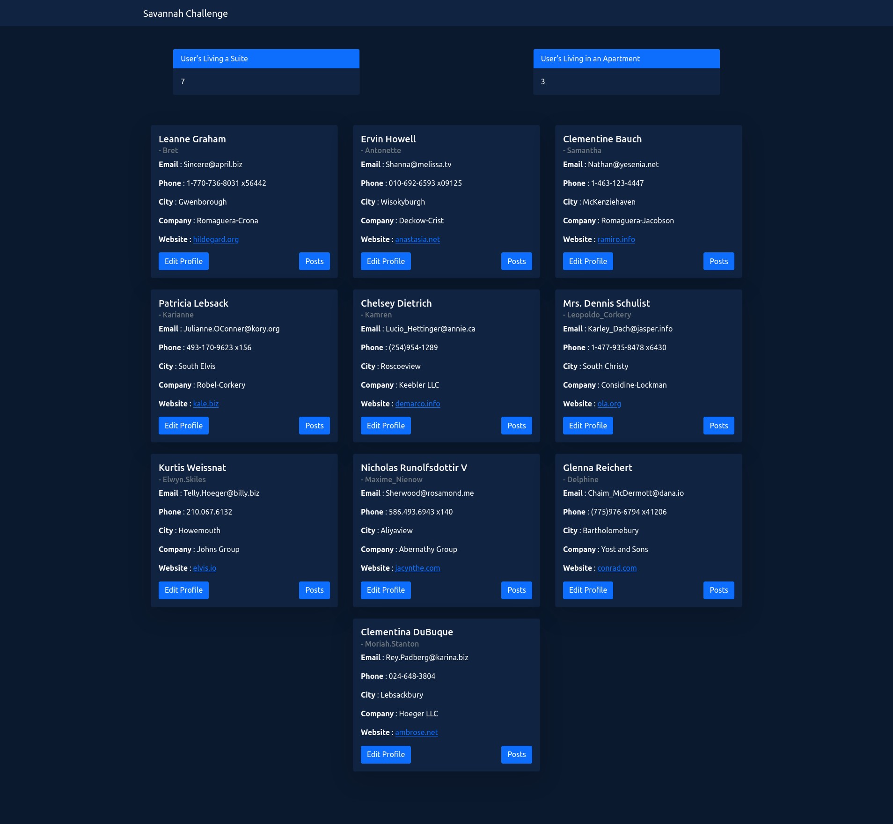

# Savannah Informatics Challenge 

## Table of contents

- [Overview](#overview)
  - [The challenge](#the-challenge)
  - [Screenshot](#screenshot)
  - [Links](#links)
- [My process](#my-process)
  - [Built with](#built-with)
  - [Useful resources](#useful-resources)
- [Author](#author)

## Overview

### The challenge

#### Specifications

- Add the option to fetch each user posts on jsonplaceholder and display them with their user.
- The name of each user should be editable, and should send the update to the server (note that the update is faked on jsonplaceholder).
- Display the number of users living in an Appt, and in a Suite (field address.suite)

### Screenshot

### Links

- Project URL: [Project Repo](https://github.com/otienotimothy/savannah-challenge.git)
- Live Site URL: [Savannah Challenge](https://savannah-challenge.netlify.app/)

## My process

### Built with

- [React](https://reactjs.org/) - JS library
- [React-Query](https://react-query.tanstack.com/) - Data Synchronization Tool
- [Bootstrap](https://getbootstrap.com/) - For styles

### Useful resources

- [React Query Docs](https://react-query.tanstack.com/overview) - This helped me get up and running quickly with react query.

## Author

**Timothy Otieno**
- Frontend Mentor - [@otienotimothy](https://www.frontendmentor.io/profile/otienotimothy)
- Twitter - [@iamtimlord](https://twitter.com/iamtimlord)

